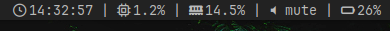

EN/RU

# Simple dwmbar — A Minimalist Status Bar for DWM 🚀



Lightweight, customizable status bar for dwm with Python widget support.  
✨ **New level of control** — add, remove, and combine modules in an instant!

---

## 🌟 Features

- 🛠 **Modular architecture** — only what you need
- ⚡ **Instant response** to changes
- 🎨 **Stylish integration** with any environment
- 🔋 **Energy efficient** — minimal system load

---

## 🧩 Available Widgets

| Module       | Icon  | Description                  |
|--------------|-------|------------------------------|
| `time`       | ⏰    | Time with customizable format |
| `memory`     | 🧠    | Real-time memory usage       |
| `cpu`        | 🔥    | CPU load                     |
| `volume`     | 🔊    | Volume control               |
| `battery`    | 🔋    | Battery level indicator      |

---

## 🚧 In Development

- 🌡️ `temperature` — CPU/GPU temperature monitoring
- 🌦️ `weather` — Weather forecast with icons
- 🌐 `internet` — Connection indicator with ping

---

## ⚡ Quick Start (Arch Linux/Manjaro)

```bash
cd
git clone https://github.com/nion26677/A-simple-dwmbar
cd A-simple-dwmbar
makepkg -si 
```

---

## 🕹️ Widget Management

**Adding modules:**
```bash
pdwmbar add time memory cpu battery volume  # Assemble your perfect set!
```

**Removing modules:**
```bash
pdwmbar del temperature weather  # When you want a change 😉
```

---

## 🔧 Configuration

Your personal control panel:  
`~/.config/pdwmbar/widgets.conf`

Example:
```conf
# Order matters!
time
cpu
memory
battery
volume
```

---


#  Simple dwmbar — Минималистичный статус-бар для DWM 🚀


Лёгкий, кастомизируемый статус-бар для dwm с поддержкой виджетов на Python.  
✨ **Новый уровень контроля** — добавляйте, удаляйте и комбинируйте модули в одно мгновение!

---

## 🌟 Особенности

- 🛠 **Модульная архитектура** — только то, что вам нужно
- ⚡ **Мгновенная реакция** на изменения
- 🎨 **Стильная интеграция** с любым окружением
- 🔋 **Энергоэффективность** — не грузит систему

---

## 🧩 Доступные виджеты

| Модуль       | Иконка | Описание                  |
|--------------|--------|---------------------------|
| `time`       | ⏰     | Время с кастомизируемым форматом |
| `memory`     | 🧠     | Использование памяти в реальном времени |
| `cpu`        | 🔥     | Нагрузка процессора|
| `volume`     | 🔊     | Контроль звука |
| `battery`    | 🔋     | Показание заряда      |

---

## 🚧 В разработке

- 🌡️ `temperature` — Мониторинг температуры CPU/GPU
- 🌦️ `weather` — Прогноз погоды с иконками
- 🌐 `internet` — Индикатор подключения с пингом

---

## ⚡ Быстрый старт (Arch Linux/Manjaro)

```bash
cd
git clone https://github.com/nion26677/A-simple-dwmbar
cd A-simple-dwmbar
makepkg -si 
```

---

## 🕹️ Управление виджетами

**Добавление модулей:**
```bash
pdwmbar add time memory cpu battery volume  # Соберите свой идеальный набор!
```

**Удаление модулей:**
```bash
pdwmbar del temperature weather  # Когда захотите перемен 😉
```
---

## 🔧 Конфигурация

Ваш персональный космический пульт:  
`~/.config/pdwmbar/widgets.conf`

Пример:
```conf
# Порядок имеет значение!
time
cpu
memory
battery
volume
```